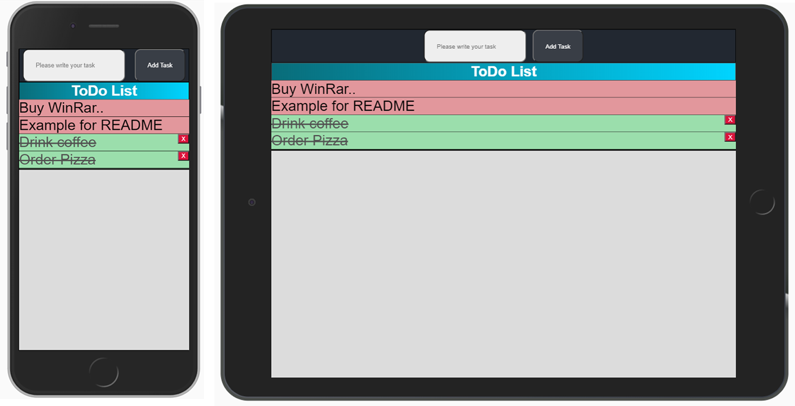

# React Todo
A react implementation of the well known todo application. Create a tasks, set them as solved, and remove completed tasks. 
Hosted: [here](https://bragereacttodo.netlify.app/) or access manually https://bragereacttodo.netlify.app/
## Test Locally
This section will be filled out shortly.

# Article 
- [Contents of App](#contents)
- [Tech Usage and Reasoning](#tech-usage-and-reasoning)
- [Challenges Faced](#challenges-faced)
- [Design](#design)
- [Full Description](#full-description)
- [Get in touch!](#contact)

# Contents
This section will be filled out shortly.

# Tech Usage and Reasoning
This section will be filled out shortly.

# Challenges Faced
This section will be filled out shortly.

# Design
Responsive design, a completion of thi section will be made shortly. 

# Full Description
This section will be filled out shortly.

# Contact
### Get in touch with me:
[][linkedin]
[][website]

 [linkedin]: https://www.linkedin.com/in/brage-rosberg/
 [website]: https://www.bragerosberg.com
